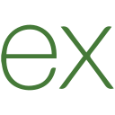
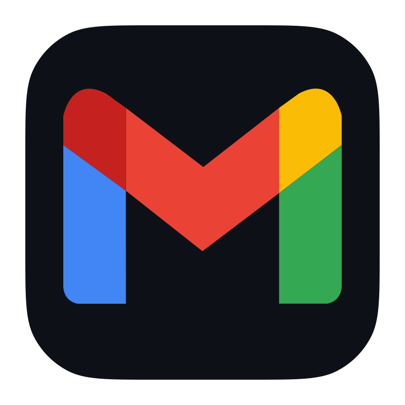

# 👋 Olá! Eu sou o Renato Oliveira

💻 **Profissional de Tecnologia da Informação**  
🎓 **Formado em Ciências da Computação**  
🛡️ **Certificação SCFE - Sec4US Certified Forensics Expert**  

### 🛠️ Tecnologias & Ferramentas

## 📫 Contato

<!--
**renatoOliveira25/renatoOliveira25** is a ✨ _special_ ✨ repository because its `README.md` (this file) appears on your GitHub profile.

Here are some ideas to get you started:

- 🔭 I’m currently working on ...
- 🌱 I’m currently learning ...
- 👯 I’m looking to collaborate on ...
- 🤔 I’m looking for help with ...
- 💬 Ask me about ...
- 📫 How to reach me: ...
- 😄 Pronouns: ...
- ⚡ Fun fact: ...
-->
